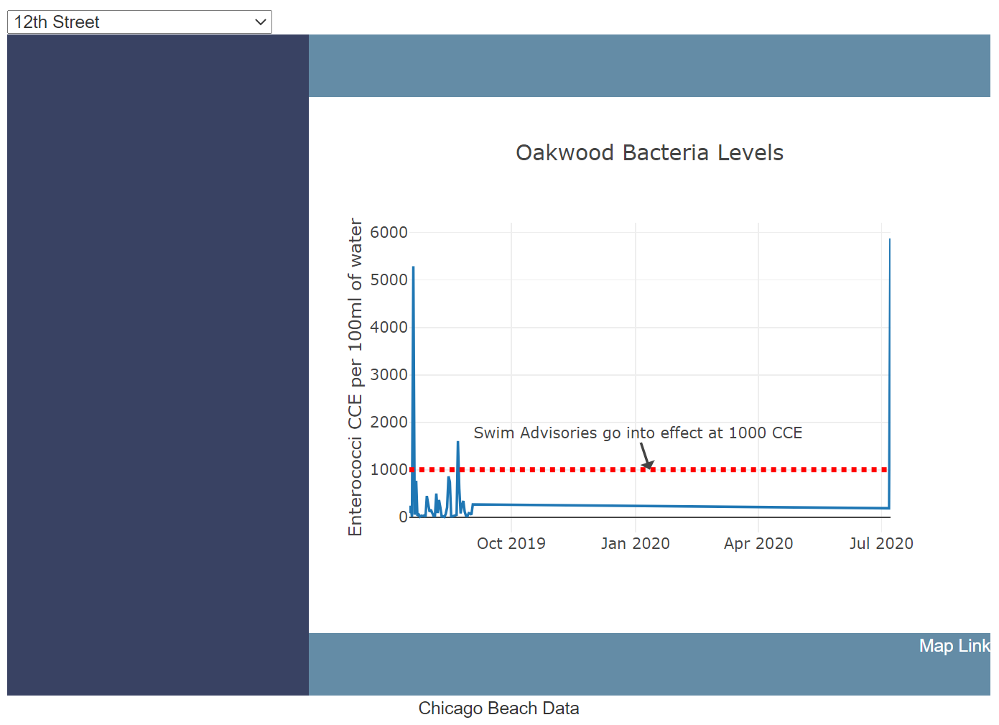

## Project 2 | Team 4 | Chicago Beach Conditions
___

#### City of Chicago Data

Source Data: 
* Selected a dataset, available in json format through an API call that pulls data from a City of Chicago model that predict E. coli levels by beach.
* [City of Chicago Data Portal: Beach E. coli Predictions](https://data.cityofchicago.org/Parks-Recreation/Beach-E-coli-Predictions/xvsz-3xcj)
* [Welcome to this Chicago API, powered by Socrata](https://dev.socrata.com/foundry/data.cityofchicago.org/xvsz-3xcj)

___
#### MongoDB & Data Table
* Database using MongoDB and Python (led by Diane)
    * Features: Multiple collections for each available dataset
    * Challenges: 
    * Successes:

___
#### Plotly & Dashboard
* Chart using Plotly and JavaScript (led by Alex)
    * Features: Dropdown filter by beach
    * Challenges:
    * Successes:

___
#### Leaflet & Map
* Map using Leaflet and JavaScript (led by Medina)
    * Features: Markers for each beach with popup Info
    * Challenges:
    * Successes:

___
#### HTML Design
* Website Design using HTML and JavaScript (created by Alex)
    * Challenges:
    * Successes:

