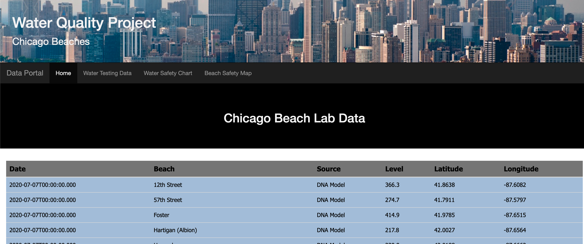

## Project 2 | Team 4 | Chicago Beach Conditions

---

**City of Chicago Data**

**Source Data:**

* Selected a dataset, available in json format through an API call that pulls data from a City of Chicago model that predict E. coli levels by beach.
* [City of Chicago Data Portal: Beach E. coli Predictions](https://data.cityofchicago.org/Parks-Recreation/Beach-E-coli-Predictions/xvsz-3xcj)
* [Chicago API, powered by Socrata](https://dev.socrata.com/foundry/data.cityofchicago.org/xvsz-3xcj)

---

**MongoDB & Data Table**

* Database using MongoDB and Python (led by Diane)
  * Features: Multiple collections for each available dataset
  * Challenges: Using the collections and variables in JavaScript, ended up creating local json files and locations to use in chart and map.
  * Successes:
    
  *

---

#### **Plotly & Dashboard**

* Chart using Plotly and JavaScript (led by Alex)
  * Features: Dropdown filter by beach
  * Challenges:
  * Successes:
    

---

#### **Leaflet & Map**

* Map using Leaflet and JavaScript (led by Medina)
  * *Features: Markers for each beach with popup info*
  * Challenges: Varying the intensity of heatmap using the mean DNA sample reading as an intensity argument
  * Successes: Map displaying 20 Chicago beaches and popups with water safety information 
    

---

**HTML Design**

* Website Design using HTML and JavaScript (created by Nabiha)
  * *Features:*
  * Challenges:
  * Successes:
    
